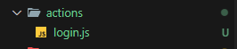
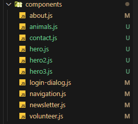
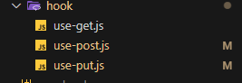
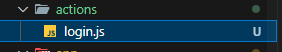

# TERMINSPRØVE Dyrevelfærd - Rafael Geisler
Navn: Rafael Geisler
Holdnummer: WU10

## Tech-stack
Jeg brugte Next.js, React.js og Tailwind CSS.
Derudeover brugte jeg npm pakke: react-toastify & axios

## URL'ER
Sidens URL: http://localhost:3000/
Sidens Login URL: På samme side

## Administrator
Brugernavn: admin
Adgangskode: 1234

## Strukture-eksempler




## Kode-eksempler

### Custom hooks
```
"use client";
import axios from "axios";
import { useEffect, useState } from "react";

function useGet(url) {
  const [data, setData] = useState([]);
  const [loading, setLoading] = useState(true);

  const getData = async () => {
    try {
      const response = await axios.get(url);
      setData(response.data);
    } catch (err) {
      console.log(err);
    } finally {
      setLoading(false);
    }
  };

  useEffect(() => {
    getData();
  }, [url]);

  return { data, loading};
}

export default useGet;
```
Beskerivelse:
Jeg gjord bruge af custom hooks som indeholder et template til en fetch GET request.
I stedet for at skrive samme opsætning af fetch strukturen i hver fil, kan et simpelt import af denne hook benyttes og formindske unødvendige gentagelser.

```
  const { data } = useGet("http://localhost:4000/api/v1/animals", {
    method: "GET",
  });

//   console.log(data);
```
Beskrivelse:
Den importeret custom hooks til at fetche med http metoden GET. En forkortet version med bedre overblik.

```
        {data &&
          data.map((animal) => {
            return (
              <li key={animal.id} className="flex border border-gray-300 w-[39em] rounded-lg">
                  
                <div className="flex flex-col p-4">
                  <h1 className="font-medium text-2xl py-4">{animal.name}</h1>
                  <p>{animal.description}</p>
                </div>
              </li>
            );
          })}
```
Beskrivelse:
Siden det er lister i form af arrays jeg fetcher i 3 gange med hver deres indehold. Bruger jeg map metoden for at bygge en liste for være index i arrayet.
Dermed har man lynhurtigt en list af forskellige slags data i stedet for at fetche for hver enkle.

### Toggle-state
```
  // Toggle state
  const [toggle, setToggle] = useState(false);

  // Handle toggle - function
  function handleToggle() {
    setToggle(!toggle);
  }
```
Beskrivelse:
I sted for at guide useren til en ny side, besluttede jeg mig for at lave en toggle state i form af en knap. Brugeren kan trykke på login knappen og en pop-up med en form kommer frem
Dette vil gør det nemt og fleksiblet for en kunde at finde rundt på hjemmesiden uden at skulle blive sent videre til et andet sted.
Efter hvert tryk skiftes datatypen fra enten false -> true eller true -> false (visible = invisible)

### SSR - login (struktur)
```

```
Beskrivelse:
Til selve login'et gør jeg brug af serveren

### Cookies
```
    const form = {
        username: formData.get("text"),
        password: formData.get("password")
    }
```
Beskrivelse:
Når administratoren har udfyldt formen (brugernavn og adgangskode) og trykket på submit, gemmes de udfyldte felter i vores server fil.

```
        const response = await fetch("http://localhost:4000/auth/token", {
            method: "POST",
            headers: {
                "Content-Type": "application/json"
            },
            body: JSON.stringify(form)
        })

        // return data from fetch post and store accessToken & userID inside cookie
        if(response.status === 200) {

            const data = await response.json()
            // Stores accestoken in cookie
            cookies().set("lh_at", data.accessToken, {maxAge: 60 * 60})
            // Stores userID in cookie
            cookies().set("lh_uid", data.id, {maxAge: 60 * 60})
            // notify user - success
        } else {
            // console.log(err)
        }
```
Beskrivelse:
Når vi nu har gemt inputtet fra administratoren sendes et post request af sted med inputtet som payload.
Når fetchet var et succe gemmes den retuneret accesstoken og brugerens id i en cookie. Hvor i administratoren har 1 times tid til at redigere på hjemmesiden.

## Vurdering af egen indsats
Det kunne have gået bedre da jeg stødte på en del problemer i forhold til fetch requests for at få status code 200 og ikke 400/500.
Kunne have brugt mere tid på projektet efter kl 16:00 for at sikre mig jeg når de vigtigste krav, yeps.